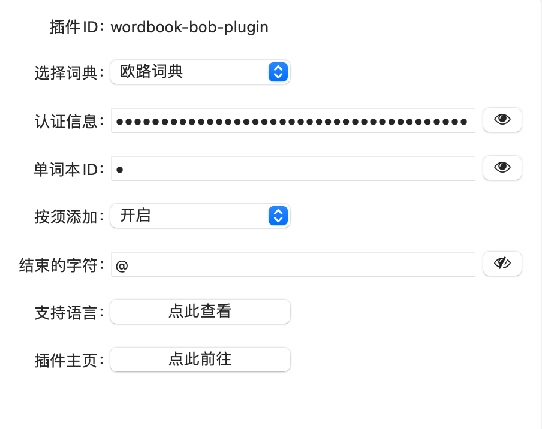
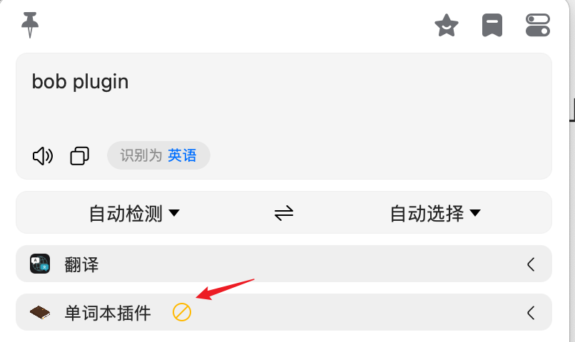
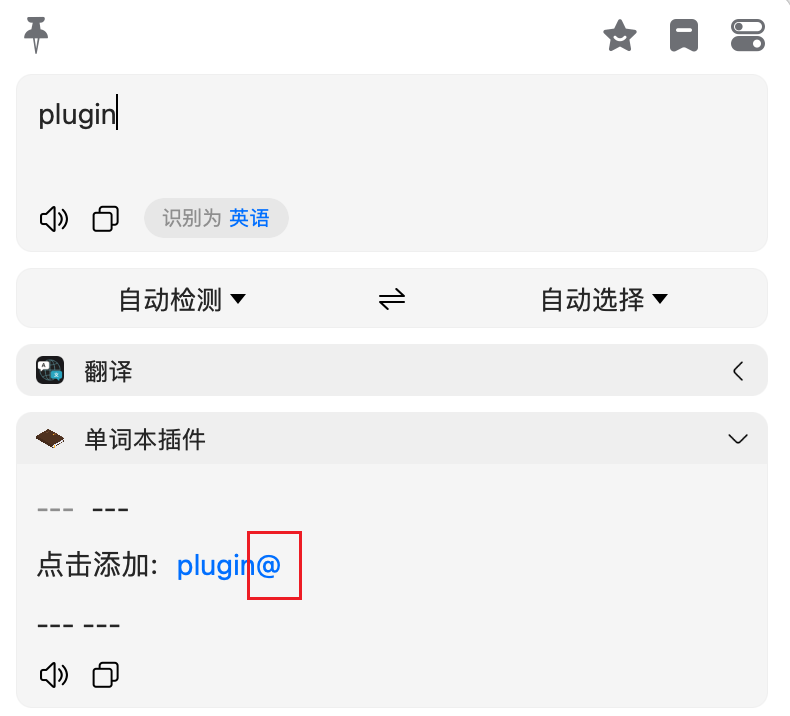
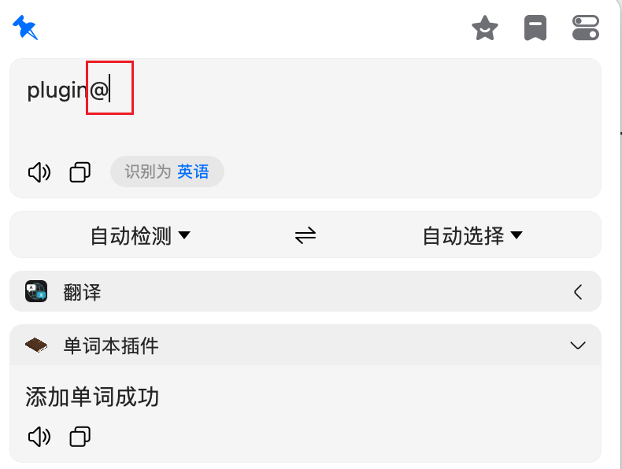

# wordbook-bob-plugin

在原版[wordbook-bob-plugin](https://github.com/yuhaowin/wordbook-bob-plugin)的基础上做了少量修改,  
主要是为了实现按须导入, 适用于bob社区版.  
bob付费版直接用原插件就可以了.

## 设置界面

## 不支持时默认不展开

## 添加界面

## 成功界面

## 缺陷

点击添加时重复查词, 浪费流量 
